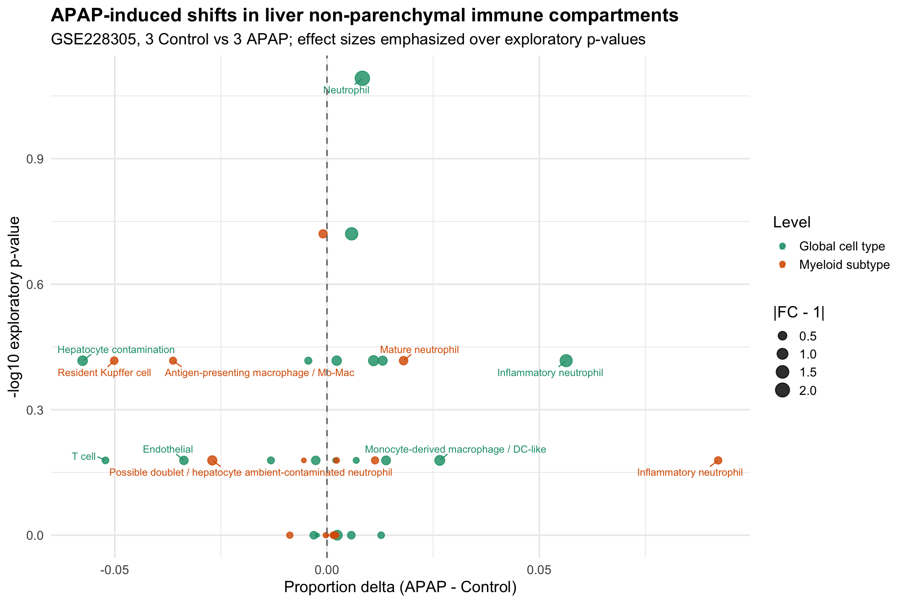

# APAP 急性肝损伤单细胞免疫微环境分析流程 -- exploratory scRNA-seq project by wrc

<p align="center">
  
</p>

> **Stage 4 组成变化总览图。**  
> 展示 GSE228305 中 APAP 处理后肝脏非实质免疫细胞组成的变化。由于样本量为 3 Control vs 3 APAP，本项目更强调 effect size 和可解释趋势，而不是把探索性 p-value 写成确定结论。

---

## 从单细胞流程复现到探索性科研分析：APAP 急性肝损伤免疫微环境重构

本仓库整理了基于 **GSE228305** 数据集的单细胞 RNA-seq 分析流程。研究对象是 APAP 诱导急性肝损伤后，肝脏非实质细胞，尤其是免疫细胞和髓系细胞的组成与功能状态变化。

这个项目的重点不是“跑出一个漂亮结论”，也不是强行复现某个固定故事，而是尽量保留真实分析中的判断过程：

- QC 阈值需要结合图形人工判断；
- 聚类 resolution 需要比较不同粒度；
- 细胞注释不能只靠自动 marker 表；
- 髓系细胞是否值得深入，需要先看数据是否支持；
- Cell communication 只作为补充筛查，不作为主线机制证据。

项目核心问题是：

> APAP 处理后，肝脏非实质免疫细胞的组成、功能状态和潜在互作轴是否出现可解释变化？

当前比较稳妥的结论是：APAP 处理后存在中性粒细胞相关群体扩张，同时 Kupffer cell、endothelial cell 和部分髓系抗原呈递/巨噬细胞群体出现转录状态变化。但这些结果仍属于探索性发现，不能写成已经验证的机制。

## Pipeline Overview / 分析全流程拆解

本项目按 5 个阶段组织。除第一阶段外，每个脚本都以上一阶段保存的 `.rds` 对象作为起点，避免把所有步骤堆在一个巨大脚本里。

### 1. QC and Integration / 质控与整合

脚本：

```text
scripts/01_QC_and_Integration.R
```

主要内容：

- 读取 6 个样本的表达矩阵；
- 构建 Seurat object；
- 计算 `nFeature_RNA`、`nCount_RNA`、`percent.mt` 等 QC 指标；
- 输出过滤前后的 QC 图，保留人工判断阈值的位置；
- 完成 normalization、PCA、Harmony integration 和 UMAP；
- 比较整合前后样本和分组的混合情况。

关键输出：

```text
data/processed/01_QC_and_Integration/seurat_integrated.rds
results/figures/01_QC_and_Integration/
results/tables/01_QC_and_Integration/sample_qc_summary.csv
```

### 2. Global Annotation / 全局细胞注释

脚本：

```text
scripts/02_Global_Annotation.R
```

主要内容：

- 在整合对象上进行全局聚类；
- 比较多个 resolution 的聚类结果；
- 结合 canonical markers、cluster marker 表和表达图进行粗粒度细胞注释；
- 输出不同细胞类型在 Control/APAP 之间的样本级比例变化；
- 初步判断髓系细胞是否值得进入 focused subclustering。

关键输出：

```text
data/processed/02_Global_Annotation/seurat_annotated.rds
results/figures/02_Global_Annotation/umap_by_celltype.pdf
results/tables/02_Global_Annotation/preliminary_cluster_annotation.csv
results/tables/02_Global_Annotation/celltype_proportions_by_sample.csv
```

### 3. Myeloid Subclustering / 髓系细胞二次聚类

脚本：

```text
scripts/03_Myeloid_Subclustering.R
```

主要内容：

- 从全局注释对象中提取髓系相关细胞；
- 在髓系细胞内部重新降维、聚类和注释；
- 区分 Resident Kupffer cell、Monocyte-derived macrophage、DC-like antigen-presenting myeloid、不同 neutrophil states 等亚群；
- 输出髓系亚群在样本和分组之间的比例变化；
- 判断髓系结构是否适合做拟时序。

这里的一个重要分析决策是：髓系 UMAP 更像多个 lineage/state 的分离结构，而不是一条清楚连续轨迹。因此第四阶段没有强行做 Monocle3 pseudotime，而是改为 APAP-Control functional comparison。

关键输出：

```text
data/processed/03_Myeloid_Subclustering/myeloid_subclustered.rds
results/figures/03_Myeloid_Subclustering/myeloid_umap_by_subcluster.pdf
results/tables/03_Myeloid_Subclustering/myeloid_preliminary_subcluster_annotation.csv
results/tables/03_Myeloid_Subclustering/myeloid_subcluster_proportions_by_sample.csv
```

### 4. APAP-Control Functional Comparison / 组间功能比较

脚本：

```text
scripts/04_APAP_Control_Functional_Comparison.R
```

这是本项目的主分析阶段。

主要内容：

- 合并 Stage 2 的 global cell type 和 Stage 3 的 myeloid subtype 比例结果；
- 构建 composition delta summary；
- 使用小型可解释 gene sets 计算 module score；
- 按样本进行 pseudobulk differential expression；
- 使用 `edgeR` QL framework 进行 APAP vs Control 比较；
- 输出用于 README 和结果整理的 summary tables。

关键输出：

```text
data/processed/04_APAP_Control_Functional_Comparison/seurat_functional_comparison.rds
results/tables/04_APAP_Control_Functional_Comparison/stage4_key_findings_summary.csv
results/tables/04_APAP_Control_Functional_Comparison/pseudobulk_de_by_celltype.csv
results/tables/04_APAP_Control_Functional_Comparison/pseudobulk_de_by_myeloid_subtype.csv
results/figures/04_APAP_Control_Functional_Comparison/composition_delta_summary.pdf
results/figures/04_APAP_Control_Functional_Comparison/function_heatmap_selected_celltypes.pdf
```

### 5. Targeted Cell Communication / 靶向细胞通讯补充筛查

脚本：

```text
scripts/05_Cell_Communication.R
```

Stage 5 不是完整 CellChat discovery analysis，而是一个轻量级、靶向的 ligand-receptor screening。

这样设计是因为 Stage 4 的结果本身并不适合继续强行扩展成宏大的细胞通讯故事。为了避免过度解读，Stage 5 只围绕 Stage 4 提示的少数轴进行检查：

- neutrophil / activated neutrophil → endothelial；
- Kupffer / macrophage → neutrophil 或 endothelial；
- antigen-presenting myeloid → T/NK；
- fibroblast / stellate → endothelial / myeloid。

方法上使用 `CellChatDB.mouse` 的 ligand-receptor pair 作为参考，但没有保存完整 CellChat object，而是手动计算：

```text
mean ligand expression in source cell type * mean receptor expression in target cell type
```

这一阶段只作为补充证据，不作为主要机制结论。

关键输出：

```text
data/processed/05_Cell_Communication/cellchat_targeted_summary.rds
results/tables/05_Cell_Communication/stage5_decision_summary.csv
results/tables/05_Cell_Communication/targeted_lr_pairs_apap_vs_control.csv
results/figures/05_Cell_Communication/targeted_interaction_delta_summary.pdf
```

## Main observations / 主要观察结果

### 1. 中性粒细胞扩张是最稳定的观察

APAP 组中 inflammatory neutrophil、activated neutrophil 和 mature neutrophil 相关群体整体呈扩张趋势。  
其中 inflammatory neutrophil 的比例变化最明显，但 pseudobulk DE 并没有给出大量显著 DEG，因此更适合表述为“组成扩张”，而不是“群体内强烈转录重塑”。

### 2. Kupffer cell 不能简单写成“减少”或“消失”

Resident Kupffer cell 在髓系亚群比例中下降，但 global Kupffer cell 层面存在较多差异表达基因。  
更稳妥的解释是：APAP 后 Kupffer 相关状态发生转录重编程，且比例变化可能受到中性粒细胞浸润和 marker 表达改变的影响。

### 3. Endothelial compartment 有损伤/激活相关信号，但方向不完全清楚

Endothelial cell 比例下降，同时存在 pseudobulk DE 信号。  
但其功能模块和上下调基因方向并不简单，因此这里不适合写成确定性的 endothelial activation 或 endothelial loss，只能作为损伤相关变化的候选线索。

### 4. Mo-Mac/DC-like 和 antigen-presenting myeloid 更适合作为探索性结果

这些细胞群体具有抗原呈递、炎症和组织清除相关表达背景，但 APAP-Control 方向不够单一。  
目前适合写为“可能参与免疫监视或损伤后状态调整”，不适合写成确定机制。

### 5. Cell communication 只提供弱补充

Targeted LR screening 提示了一些候选互作，例如：

- fibroblast/stromal `App-Cd74`；
- Kupffer cell → inflammatory neutrophil 的 `Cxcl2-Cxcr2`、`Ccl6-Ccr1`；
- inflammatory neutrophil → endothelial 的 `Thbs1-Cd47`。

这些结果只作为 Stage 4 的补充线索，不作为独立发现。

## Repository layout

```text
scripts/              # 五个阶段的 R 脚本
data/external/        # 原始数据占位目录，实际大文件不上传 GitHub
data/processed/       # 中间 Seurat 对象和阶段输出，默认不纳入 Git
results/tables/       # marker、比例、pseudobulk、module score、LR screening 等结果表
results/figures/      # QC、UMAP、比例图、功能热图和补充通讯图
notes/                # 分析笔记、问题记录和阶段决策说明
environment.yml       # conda 环境骨架
```

## Data note

单细胞项目的中间对象非常大，不适合直接上传 GitHub。当前主要空间来自 Seurat RDS：

```text
Stage 1 integrated Seurat object:      about 1.8G
Stage 2 annotated Seurat object:       about 1.8G
Stage 3 myeloid Seurat object:         about 2.2G
Stage 4 functional-comparison object:  about 4.0G
Stage 5 targeted summary object:       less than 1M
```

因此仓库中更适合保留：

- scripts；
- README；
- notes；
- 关键结果表；
- 关键图片；
- environment.yml。

大体积 `data/processed/*.rds` 文件可以在项目归档后删除，必要时根据脚本重新生成。

## How to run

建议在仓库根目录运行脚本。环境名称不强制，但需要安装 `environment.yml` 和 `package_versions_current.csv` 中记录的 R 包。

```bash
conda activate singlecell
```

```r
source("scripts/01_QC_and_Integration.R")
source("scripts/02_Global_Annotation.R")
source("scripts/03_Myeloid_Subclustering.R")
source("scripts/04_APAP_Control_Functional_Comparison.R")
source("scripts/05_Cell_Communication.R")
```

## Environment & Dependencies

本项目当前运行环境为 conda environment `singlecell`。  
核心版本记录见：

- `environment.yml`
- `results/tables/package_versions_current.csv`
- 各阶段 `sessionInfo_*.txt`

主要依赖如下：

| 类别 | 包 | 用途 |
|:--|:--|:--|
| 单细胞分析 | `Seurat`, `SeuratObject`, `harmony` | 构建对象、整合、聚类、降维和可视化 |
| marker 分析 | `Seurat`, `presto` | cluster marker 和亚群 marker 提取 |
| 差异表达 | `edgeR` | sample-level pseudobulk APAP-Control 比较 |
| 数据整理 | `dplyr`, `tidyr`, `readr`, `tibble` | 表格读写与整理 |
| 可视化 | `ggplot2`, `patchwork`, `pheatmap`, `ggrepel`, `RColorBrewer` | UMAP、dotplot、热图、summary plot |
| 通讯参考 | `CellChat`, `NMF`, `ComplexHeatmap`, `circlize` | ligand-receptor 数据库和补充可视化支持 |

> Reproducibility note:  
> `environment.yml` 是可创建环境的 conda 骨架；部分 R 包，尤其是 `CellChat`、`presto`、`edgeR` 和 `ComplexHeatmap`，可能需要在 R 内通过 `BiocManager` 或 `remotes` 补装。当前实际可运行版本见 `results/tables/package_versions_current.csv`。

## Interpretation limits / 结果边界

本项目所有结论都应按探索性分析理解：

- 样本量为 3 Control vs 3 APAP，统计效力有限；
- 细胞比例变化不等于绝对细胞数量变化；
- module score 代表表达程序，不等于直接通路活性；
- pseudobulk DE 比细胞级检验更稳妥，但仍受样本量限制；
- Stage 5 是 targeted ligand-receptor screening，不是完整通讯网络发现。

因此最终叙事建议保持克制：  
本项目支持 APAP 后非实质免疫微环境发生重塑，尤其是中性粒细胞扩张和 Kupffer/endothelial/myeloid 状态变化；但具体调控机制仍需要更多样本、实验验证或独立数据集支持。
